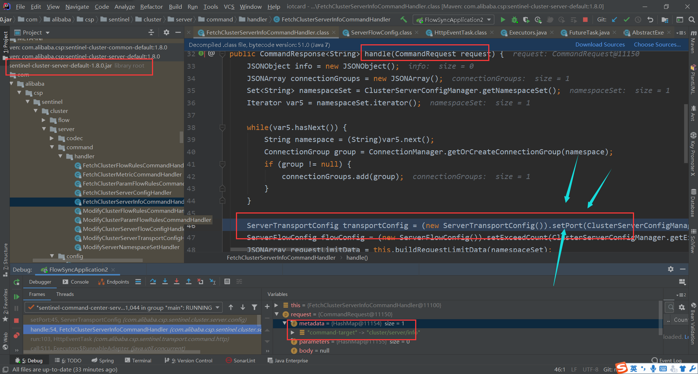
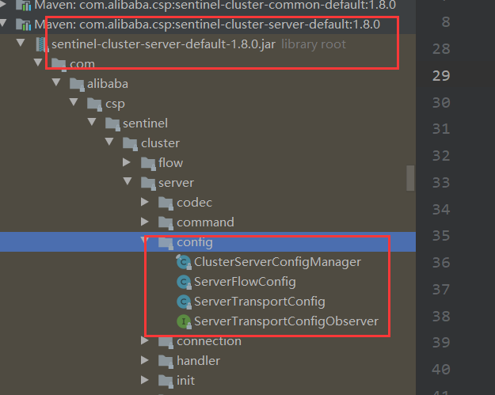
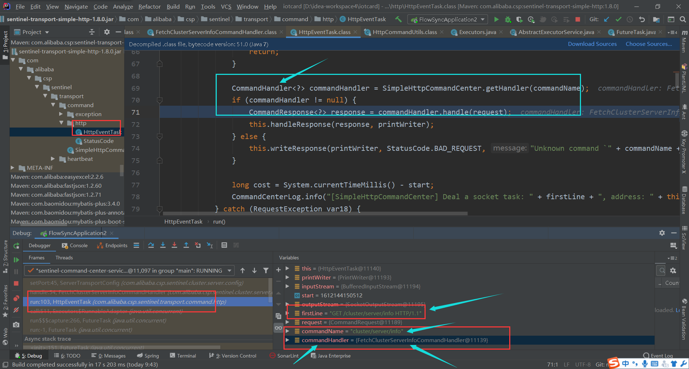
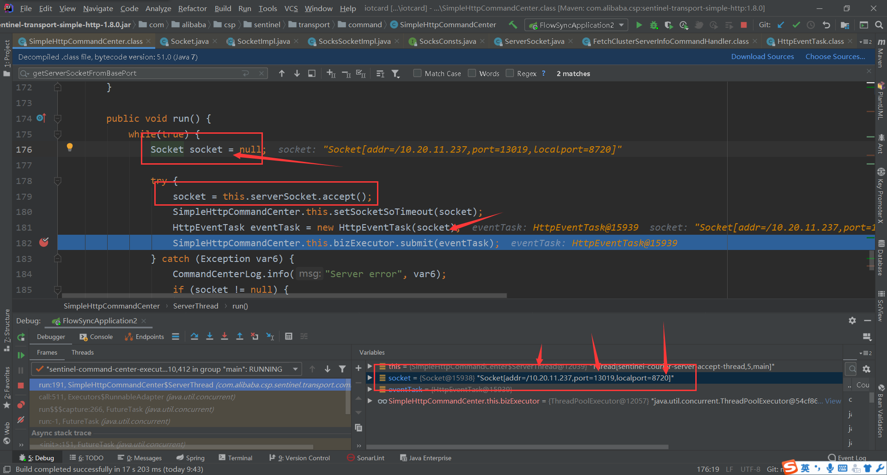

** {{ title }} ** <Excerpt in index | 首页摘要>


<!-- more -->


#### ServerTransportConfig\配置transport.port用途
8719端口配置如下：
```java
iotcard.cloud.sentinel.transport.port=8719
```

对应配置类为com.alibaba.csp.sentinel.cluster.server.config.ServerTransportConfig

```java
public class ServerTransportConfig {
    public static final int DEFAULT_IDLE_SECONDS = 600;
    private int port;
    private int idleSeconds;
```
调试发现当点击控制台的集群流控，就跳到


com.alibaba.csp.sentinel.cluster.server.command.handler.FetchClusterServerInfoCommandHandler#handle
```java
    public CommandResponse<String> handle(CommandRequest request) {
        JSONObject info = new JSONObject();
        JSONArray connectionGroups = new JSONArray();
        Set<String> namespaceSet = ClusterServerConfigManager.getNamespaceSet();
        Iterator var5 = namespaceSet.iterator();

        while(var5.hasNext()) {
            String namespace = (String)var5.next();
            ConnectionGroup group = ConnectionManager.getOrCreateConnectionGroup(namespace);
            if (group != null) {
                connectionGroups.add(group);
            }
        }

        ServerTransportConfig transportConfig = (new ServerTransportConfig()).setPort(ClusterServerConfigManager.getPort()).setIdleSeconds(ClusterServerConfigManager.getIdleSeconds());
        ServerFlowConfig flowConfig = (new ServerFlowConfig()).setExceedCount(ClusterServerConfigManager.getExceedCount()).setMaxOccupyRatio(ClusterServerConfigManager.getMaxOccupyRatio()).setIntervalMs(ClusterServerConfigManager.getIntervalMs()).setSampleCount(ClusterServerConfigManager.getSampleCount()).setMaxAllowedQps(ClusterServerConfigManager.getMaxAllowedQps());
        JSONArray requestLimitData = this.buildRequestLimitData(namespaceSet);
        info.fluentPut("port", ClusterServerConfigManager.getPort()).fluentPut("connection", connectionGroups).fluentPut("requestLimitData", requestLimitData).fluentPut("transport", transportConfig).fluentPut("flow", flowConfig).fluentPut("namespaceSet", namespaceSet).fluentPut("embedded", ClusterServerConfigManager.isEmbedded());
        info.put("appName", AppNameUtil.getAppName());
        return CommandResponse.ofSuccess(info.toJSONString());
    }
```
其中这行设置端口
```java
        ServerTransportConfig transportConfig = (new ServerTransportConfig()).setPort(ClusterServerConfigManager.getPort()).setIdleSeconds(ClusterServerConfigManager.getIdleSeconds());
```
分析：由于控制台要推送规则到配置中心或者客户端，则必须要连接到客户端，所以客户端必须提供个端口
才能建立连接，所以有默认个18730端口,所以ServerTransportConfig中的port就是这个端口




服务端配置类：



#### 调用链：  
```java

setPort:45, ServerTransportConfig (com.alibaba.csp.sentinel.cluster.server.config)
handle:54, FetchClusterServerInfoCommandHandler (com.alibaba.csp.sentinel.cluster.server.command.handler)
run:103, HttpEventTask (com.alibaba.csp.sentinel.transport.command.http)
call:511, Executors$RunnableAdapter (java.util.concurrent)
run$$$capture:266, FutureTask (java.util.concurrent)
run:-1, FutureTask (java.util.concurrent)
 - Async stack trace
<init>:151, FutureTask (java.util.concurrent)
newTaskFor:87, AbstractExecutorService (java.util.concurrent)
submit:111, AbstractExecutorService (java.util.concurrent)
run:191, SimpleHttpCommandCenter$ServerThread (com.alibaba.csp.sentinel.transport.command)
call:511, Executors$RunnableAdapter (java.util.concurrent)
run$$$capture:266, FutureTask (java.util.concurrent)
run:-1, FutureTask (java.util.concurrent)
 - Async stack trace
<init>:151, FutureTask (java.util.concurrent)
newTaskFor:87, AbstractExecutorService (java.util.concurrent)
submit:111, AbstractExecutorService (java.util.concurrent)
submit:678, Executors$DelegatedExecutorService (java.util.concurrent)
run:106, SimpleHttpCommandCenter$2 (com.alibaba.csp.sentinel.transport.command)
run:745, Thread (java.lang)

```

分析：

调用ClusterStateManager.registerProperty(clusterModeDs.getProperty());设置服务端状态时，
触发 init:40, CommandCenterInitFunc (com.alibaba.csp.sentinel.transport.init)
继续触发 start:75, SimpleHttpCommandCenter (com.alibaba.csp.sentinel.transport.command)
而在SimpleHttpCommandCenter.start里会新建个serverSocket来监听接收消息
```java   
       executor.submit(new ServerThread(serverSocket));
```
如下：
这里收到消息时会开线程调用执行HttpEventTask这个任务
```java
   class ServerThread extends Thread {

        private ServerSocket serverSocket;

        ServerThread(ServerSocket s) {
            this.serverSocket = s;
            setName("sentinel-courier-server-accept-thread");
        }

        @Override
        public void run() {
            while (true) {
                Socket socket = null;
                try {
                    socket = this.serverSocket.accept();
                    setSocketSoTimeout(socket);
                    HttpEventTask eventTask = new HttpEventTask(socket);
                    bizExecutor.submit(eventTask);
                } catch (Exception e) {
                    CommandCenterLog.info("Server error", e);
                    if (socket != null) {
                        try {
                            socket.close();
                        } catch (Exception e1) {
                            CommandCenterLog.info("Error when closing an opened socket", e1);
                        }
                    }
                    try {
                        // In case of infinite log.
                        Thread.sleep(10);
                    } catch (InterruptedException e1) {
                        // Indicates the task should stop.
                        break;
                    }
                }
            }
        }
    }
```
那什么时候触发这里的接收消息，当在sentinel控制台里点击集群监控，就会触发到这里
如下：  

控制台调用cluster/server/info这个http请求获取集群服务器的信息，上面的ServerSocket这个监听
会根据请求路径来解析到FetchClusterServerInfoCommandHandler处理器  
所以会有下面的HttpEventTask任务跳转到FetchClusterServerInfoCommandHandler处理

handle:54, FetchClusterServerInfoCommandHandler (com.alibaba.csp.sentinel.cluster.server.command.handler)
run:103, HttpEventTask (com.alibaba.csp.sentinel.transport.command.http)


问题：
看了sentinel控制台集群流控的源码，好像没有调用http请求，那这个接收到的socket请求来自哪里的？？？
难度是在新建ServerThread这个serverSocket线程时 new HttpEventTask(socket)这个时执行的，应该是??
但是为什么点击sentinel控制台的集群监控会触发这个调试呢？？


sentinel控制台调用地方：
直接搜索cluster/server/info点调用即可出来


前端入口：
Request URL: http://localhost:9090/cluster/server_state/FlowSyncApplication

- com.alibaba.csp.sentinel.dashboard.controller.cluster.ClusterConfigController#apiGetClusterServerStateOfApp
- com.alibaba.csp.sentinel.dashboard.service.ClusterConfigService#getClusterUniversalState(java.lang.String)
```java
    public CompletableFuture<List<ClusterUniversalStatePairVO>> getClusterUniversalState(String app) {
        if (StringUtil.isBlank(app)) {
            return AsyncUtils.newFailedFuture(new IllegalArgumentException("app cannot be empty"));
        }
        AppInfo appInfo = appManagement.getDetailApp(app);
        if (appInfo == null || appInfo.getMachines() == null) {
            return CompletableFuture.completedFuture(new ArrayList<>());
        }

        List<CompletableFuture<ClusterUniversalStatePairVO>> futures = appInfo.getMachines().stream()
            .filter(e -> e.isHealthy())
            .map(machine -> getClusterUniversalState(app, machine.getIp(), machine.getPort())
                .thenApply(e -> new ClusterUniversalStatePairVO(machine.getIp(), machine.getPort(), e)))
            .collect(Collectors.toList());

        return AsyncUtils.sequenceSuccessFuture(futures);
    }
```
可以看到是根据machine的ip和port端口(默认8719)来请求客户端的，这个machine来自appManagement，具体是由心跳检测上报在sentinel控制台的
具体又调到getClusterUniversalState方法

```java
    public CompletableFuture<ClusterUniversalStateVO> getClusterUniversalState(String app, String ip, int port) {
        return sentinelApiClient.fetchClusterMode(ip, port)
            .thenApply(e -> new ClusterUniversalStateVO().setStateInfo(e))
            .thenCompose(vo -> {
                if (vo.getStateInfo().getClientAvailable()) {
                    return sentinelApiClient.fetchClusterClientInfoAndConfig(ip, port)
                        .thenApply(cc -> vo.setClient(new ClusterClientStateVO().setClientConfig(cc)));
                } else {
                    return CompletableFuture.completedFuture(vo);
                }
            }).thenCompose(vo -> {
                if (vo.getStateInfo().getServerAvailable()) {
                    return sentinelApiClient.fetchClusterServerBasicInfo(ip, port)
                        .thenApply(vo::setServer);
                } else {
                    return CompletableFuture.completedFuture(vo);
                }
            });
    }
```
又调到sentinelApiClient.fetchClusterServerBasicInfo(ip, port)
下面其中FETCH_CLUSTER_SERVER_BASIC_INFO_PATH就是cluster/server/info
```java

    public CompletableFuture<ClusterServerStateVO> fetchClusterServerBasicInfo(String ip, int port) {
        if (StringUtil.isBlank(ip) || port <= 0) {
            return AsyncUtils.newFailedFuture(new IllegalArgumentException("Invalid parameter"));
        }
        try {
            return executeCommand(ip, port, FETCH_CLUSTER_SERVER_BASIC_INFO_PATH, false)
                .thenApply(r -> JSON.parseObject(r, ClusterServerStateVO.class));
        } catch (Exception ex) {
            logger.warn("Error when fetching cluster sever all config and basic info", ex);
            return AsyncUtils.newFailedFuture(ex);
        }
    }
```


看日志  
Socket[addr=/10.20.11.237,port=13019,localport=8720]
可以看到接收到的端口是8720  

另外关于port和localport的:

java.net.SocketImpl
```

    /**
     * The port number on the remote host to which this socket is connected.
     */
    protected int port;

    /**
     * The local port number to which this socket is connected.
     */
    protected int localport;
```
 localport 是本机端口， socket port 应该是 server port 吧，表示对端端口
tcp/ip 中使用 本地ip:port <=> 远程 ip :port 表示一个通信
参考：[https://zhidao.baidu.com/question/691871712846751924.html](https://zhidao.baidu.com/question/691871712846751924.html)


而FetchClusterServerInfoCommandHandler
setPort:45, ServerTransportConfig (com.alibaba.csp.sentinel.cluster.server.config)
handle:54, FetchClusterServerInfoCommandHandler (com.alibaba.csp.sentinel.cluster.server.command.handler)


