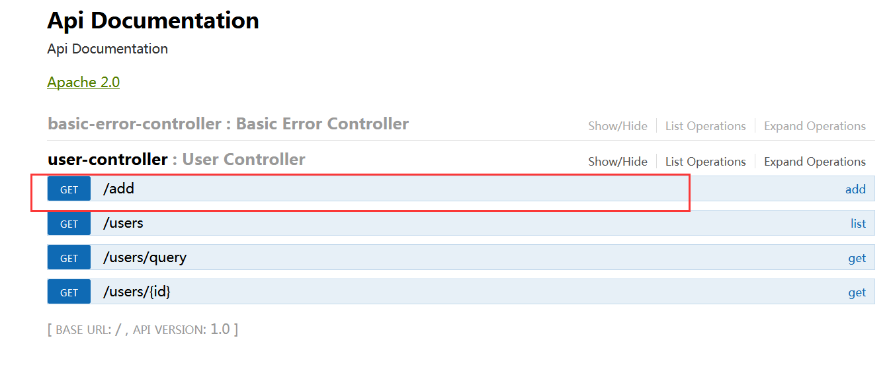
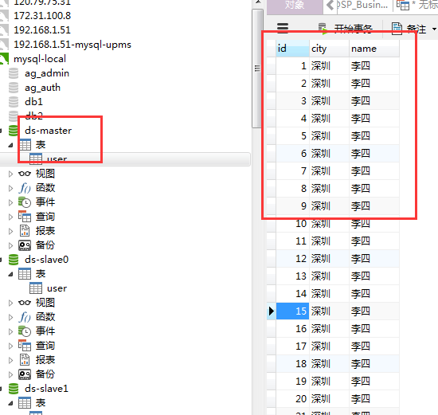

** {{ title }} ** <Excerpt in index | 首页摘要>


<!-- more -->

### 1、准备数据库
创建3个数据库，然后在各自数据库里创建一个user表

```
CREATE DATABASE `ds-master` CHARACTER SET 'utf8' COLLATE 'utf8_general_ci';
CREATE DATABASE `ds-slave0` CHARACTER SET 'utf8' COLLATE 'utf8_general_ci';
CREATE DATABASE `ds-slave1` CHARACTER SET 'utf8' COLLATE 'utf8_general_ci';


CREATE TABLE `user`(

    id bigint(64) auto_increment not null,

    city varchar(20) not null,

    name varchar(20) not null,

    PRIMARY KEY (`id`)

) ENGINE=InnoDB DEFAULT CHARSET=utf8;

```

### 2、引入Maven依赖

```
        <properties>
            <sharding-sphere.version>4.0.0-RC1</sharding-sphere.version>
        </properties>
    
        <dependency>
            <groupId>org.apache.shardingsphere</groupId>
            <artifactId>sharding-jdbc-spring-boot-starter</artifactId>
            <version>${sharding-sphere.version}</version>
        </dependency>
        <!-- for spring namespace -->
        <dependency>
            <groupId>org.apache.shardingsphere</groupId>
            <artifactId>sharding-jdbc-spring-namespace</artifactId>
            <version>${sharding-sphere.version}</version>
        </dependency>
```

### 3、配置数据源和读写分离

```
spring:
  shardingsphere:
    datasource:
      names: ds-master,ds-slave0,ds-slave1
      ds-master: 
        type: com.alibaba.druid.pool.DruidDataSource
        driverClassName: com.mysql.jdbc.Driver
        url: jdbc:mysql://localhost:3306/ds-master?useUnicode=true&characterEncoding=utf8&useSSL=false&serverTimezone=Asia/Shanghai
        username: root
        password: root
      ds-slave0: 
        type: com.alibaba.druid.pool.DruidDataSource
        driverClassName: com.mysql.jdbc.Driver
        url: jdbc:mysql://localhost:3306/ds-slave0?useUnicode=true&characterEncoding=utf8&useSSL=false&serverTimezone=Asia/Shanghai
        username: root
        password: root
      ds-slave1: 
        type: com.alibaba.druid.pool.DruidDataSource
        driverClassName: com.mysql.jdbc.Driver
        url: jdbc:mysql://localhost:3306/ds-slave1?useUnicode=true&characterEncoding=utf8&useSSL=false&serverTimezone=Asia/Shanghai
        username: root
        password: root

    masterslave:
       name: ds-ms # 名称,合法的字符串即可,但如果涉及到在读写分离的基础上设置分库分表,则名称需要有意义才可以,另外,虽然目前没有强制要求,但主从库配置需要配置在实际关联的主从库上,如果配置的数据源之间主从是断开的状态,那么可能会发生写入的数据对于只读会话无法读取到的问题
       masterDataSourceName: ds-master # 主库的DataSource名称
       slaveDataSourceNames: # 从库的DataSource列表,至少需要有一个
          - ds-slave0
          - ds-slave1
       loadBalanceAlgorithmClassName: org.apache.shardingsphere.api.algorithm.masterslave # MasterSlaveLoadBalanceAlgorithm接口的实现类,允许自定义实现 默认提供两个,配置路径为org.apache.shardingsphere.api.algorithm.masterslave下的RandomMasterSlaveLoadBalanceAlgorithm(随机Random)与RoundRobinMasterSlaveLoadBalanceAlgorithm(轮询:次数%从库数量)
      #loadBalanceAlgorithmType: #从库负载均衡算法类型，可选值：ROUND_ROBIN，RANDOM。若loadBalanceAlgorithmClassName存在则忽略该配置,默认为ROUND_ROBIN

    props:
      sql.show: true #是否开启SQL显示，默认值: false
      # acceptor.size: # accept连接的线程数量,默认为cpu核数2倍
      # executor.size: #工作线程数量最大，默认值: 无限制
      # max.connections.size.per.query: # 每个查询可以打开的最大连接数量,默认为1
      # proxy.frontend.flush.threshold: # proxy的服务时候,对于单个大查询,每多少个网络包返回一次
      # proxy.transaction.type: # 默认LOCAL,proxy的事务模型 允许LOCAL,XA,BASE三个值 LOCAL无分布式事务,XA则是采用atomikos实现的分布式事务 BASE目前尚未实现
      #  proxy.opentracing.enabled: # 是否启用opentracing
      # proxy.backend.use.nio: # 是否采用netty的NIO机制连接后端数据库,默认False ,使用epoll机制
      # proxy.backend.max.connections: # 使用NIO而非epoll的话,proxy后台连接每个netty客户端允许的最大连接数量(注意不是数据库连接限制) 默认为8
      # proxy.backend.connection.timeout.seconds: #使用nio而非epoll的话,proxy后台连接的超时时间,默认60s
      # check.table.metadata.enabled: # 是否在启动时候,检查sharing的表的实际元数据是否一致,默认False

```

### 4、新建springboot的Application应用启动类
注意排除掉DruidDataSourceAutoConfigure类的自动加载，引入Swagger

```
package com.demo;

import com.alibaba.druid.spring.boot.autoconfigure.DruidDataSourceAutoConfigure;
import org.mybatis.spring.annotation.MapperScan;
import org.springframework.boot.Banner;
import org.springframework.boot.SpringApplication;
import org.springframework.boot.autoconfigure.SpringBootApplication;
import springfox.documentation.swagger2.annotations.EnableSwagger2;

import java.util.HashMap;

@SpringBootApplication(exclude = {DruidDataSourceAutoConfigure.class})
@EnableSwagger2
@MapperScan({ "com.demo.mapper*", "com.demo.open.mapper*" })//这里不定义的话，则要在mapper文件里加上@Mapper注解
public class ShardingJdbcDemoApplication {
    public static void main(String[] args) {
        SpringApplication app = new SpringApplication(ShardingJdbcDemoApplication.class);
        app.setBannerMode(Banner.Mode.OFF);
        app.run(args);
        HashMap hashMap=new HashMap();
    }
}

```

### 5、新建实体对象User

```
package com.demo.entity;

import lombok.Data;

import java.io.Serializable;

@Data
public class User implements Serializable {

    private static final long serialVersionUID = -1;

    private Long id;

    private String city = "";

    private String name = "";


}

```


### 6、新建mapper

```
package com.demo.mapper;

import java.util.List;

import com.demo.entity.User;
import org.apache.ibatis.annotations.Mapper;


@Mapper
public interface UserMapper {
	
	Long addUser(User user);
	
	List<User> list();
	
	User findById(Long id);
	
	User findByName(String name);
}

```

### 7、新建UserService以及实现类

```
package com.demo.service;

import com.demo.entity.User;

import java.util.List;

public interface UserService {

	List<User> list();
	
	Long add(User user);
	
	User findById(Long id);
	
	User findByName(String name);
	
}

```

实现：

```
package com.demo.service.impl;

import com.demo.entity.User;
import com.demo.mapper.UserMapper;
import com.demo.service.UserService;
import org.springframework.beans.factory.annotation.Autowired;
import org.springframework.stereotype.Service;

import java.util.List;

@Service
public class UserServiceImpl implements UserService {

	@Autowired
	private UserMapper userMapper;
	
	public List<User> list() {
		return userMapper.list();
	}

	public Long add(User user) {
		return userMapper.addUser(user);
	}

	@Override
	public User findById(Long id) {
		return userMapper.findById(id);
	}

	@Override
	public User findByName(String name) {
		return userMapper.findByName(name);
	}

} 
```


### 8、新建UserController

```
package com.demo.web;

import com.demo.entity.User;
import com.demo.service.UserService;
import org.springframework.beans.factory.annotation.Autowired;
import org.springframework.web.bind.annotation.GetMapping;
import org.springframework.web.bind.annotation.PathVariable;
import org.springframework.web.bind.annotation.RestController;


@RestController
public class UserController {
	
	@Autowired
	private UserService userService;
	
	@GetMapping("/users")
	public Object list() {
		return userService.list();
	}
	
	@GetMapping("/add")
	public Object add() {
		for (long i = 0; i < 100; i++) {
			User user = new User();
			user.setCity("深圳");
			user.setName("李四");
			userService.add(user);
		}
		return "success";
	}
	
	@GetMapping("/users/{id}")
	public Object get(@PathVariable Long id) {
		return userService.findById(id);
	}
	
	@GetMapping("/users/query")
	public Object get(String name) {
		return userService.findByName(name);
	}
	
}

```

### 9、swagger测试

访问http://localhost:8081/swagger-ui.html#/ 

##### 9.1、增加数据
先调用http://localhost:8081/add方法增加主库ds-master的数据



查看数据库，ds-master已有数据，而ds-slave0,ds-slave1没有数据


##### 9.2、查询
调用http://localhost:8081/users查询，查看后台日志如下：
```
2019-08-07 11:40:09,920 http-nio-8081-exec-4 INFO org.apache.shardingsphere.core.route.SQLLogger:89 [http-nio-8081-exec-4] Rule Type: master-slave

2019-08-07 11:40:09,920 http-nio-8081-exec-4 INFO org.apache.shardingsphere.core.route.SQLLogger:89 [http-nio-8081-exec-4] SQL: SELECT u.* FROM user u ::: DataSources: ds-slave0

```
分析日志：
> 1、Rule Type规则类型为主从master-slave，也就是读写分离  
> 2、SQL: SELECT u.* FROM user u ::: DataSources: ds-slave0 这句说明是从从库ds-slave0查询的


参考：https://shardingsphere.apache.org/document/current/cn/manual/sharding-jdbc/usage/read-write-splitting/

