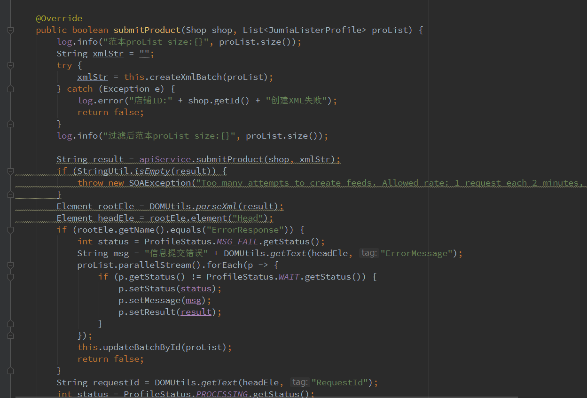
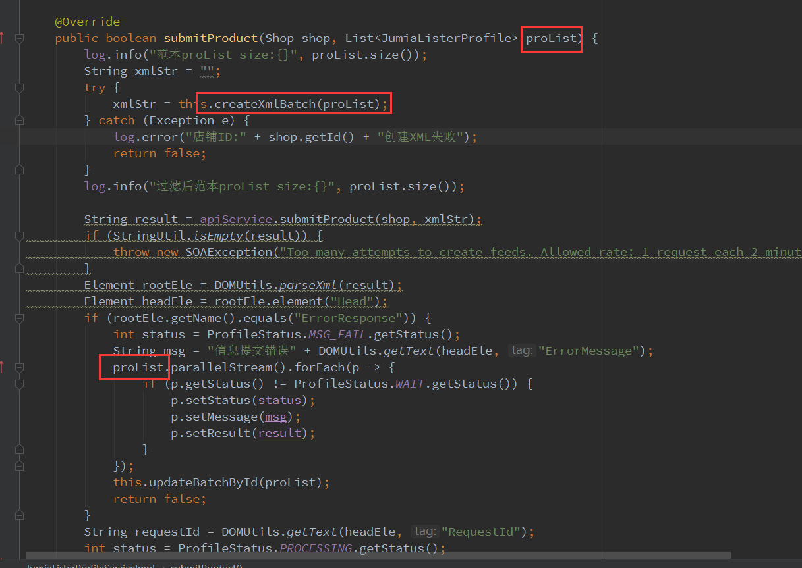

** {{ title }} ** <Excerpt in index | 首页摘要>


<!-- more -->

#### 1、引用对象发生变化导致的问题 
 
如下图：分析此代码有啥问题




分析：看下面的红框处，该方法看起来是没什么大问题，proList传递进来的是个引用，
问题出在第二个红框(该方法是根据proList生成xml文件)处，该同事在第二个红框的代码里拦截掉一部分proList列表里的值，
但是该同事没有对拦截掉的部分进行删除，导致proList这个还是原来的，
而第三个红框该同事又对proList所有对象进行调用api后的返回结果进行设置，注意这里更改的proList包含了
刚才第二个框框里拦截的部分对象，这样就导致有问题,   
所以第二个框框拦截的时候，也要对proList里拦截的对象进行删除





#### 2、常见删除List里元素的方法

##### 1、使用iterator
```
        List<String> list = new ArrayList<>();
        list.add("aa");
        list.add("bb");
        list.add("cc");
        Iterator<String> it = list.iterator();
        while(it.hasNext()){
            String str = (String)it.next();
            if("aa".equals(str)){
                it.remove();
            }
        }
        System.out.println(list.size());

```

##### 2、倒序(不能正序，否则有数组溢出)

```
        List<String> list = new ArrayList<>();
        list.add("aa");
        list.add("bb");
        list.add("cc");
        for (int i = list.size() - 1; i >= 0; i--) {
            String str = list.get(i);
            if ("aa".equals(str)) {
                list.remove(str);
            }
        }
        System.out.println(list.size());

```

##### 3、使用CopyOnWriteArrayList
```
        List<String> list = new ArrayList<>();
        list.add("aa");
        list.add("bb");
        list.add("cc");
        CopyOnWriteArrayList<String> cowList = new CopyOnWriteArrayList<String>(list);
        for (String str : cowList) {
            if ("aa".equals(str)) {
                cowList.remove(str);
            }
        }
        System.out.println(cowList.size());
```
